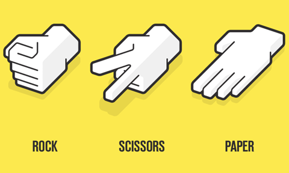
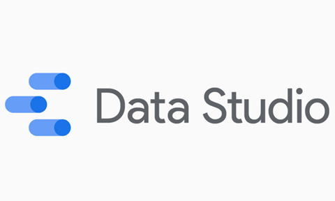
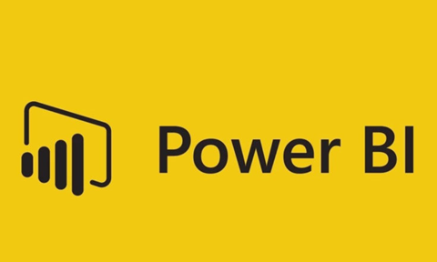
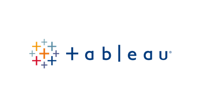

## SQL Database
  - [Chinook](https://github.com/maypn/myPortfolio/blob/a9173b5bdcc126a89c280b081f88f5e1845e884c/SQL%20Database/chinook.sql) - Explored and analysed data by using subqueries, window function and many more. 
    
    
    
  - [Restaurant database](https://github.com/maypn/myPortfolio/blob/a9173b5bdcc126a89c280b081f88f5e1845e884c/SQL%20Database/Restaurant_Database.sql) - Using SQL to bulit a restaurant database.
    
    
  
## R Programming
  - [Rock Paper Scissors Game](https://github.com/maypn/myPortfolio/blob/a9173b5bdcc126a89c280b081f88f5e1845e884c/R%20Programming/Rock_Paper_Scissors_Game.R) 
     
    
    
## Python Programming
  - [Analyzing Sales Data](https://github.com/maypn/myPortfolio/blob/f5b7c36686e4c2e68cdff30b1675d6d61fc01b73/Python%20Programming/Analyzing_Sales_Data.ipynb)
    
    
  
  - [OOP_ATM](https://github.com/maypn/myPortfolio/blob/f5b7c36686e4c2e68cdff30b1675d6d61fc01b73/Python%20Programming/OOP_ATM.py) 
     
     
    
    
  - [Rock Paper Scissors Game](https://github.com/maypn/myPortfolio/blob/a9173b5bdcc126a89c280b081f88f5e1845e884c/Python%20Programming/Rock_Paper_Scissors_Game.py)
     
    
    
    
  
## Data Visualization
  - [Sales Report](https://github.com/maypn/myPortfolio/blob/85ae46169ee49305a047d90410892d344ce15914/Dashboard/Sales_Report.pdf) - Dashborad of sales report using Data Studio
  
    
    
  - [Summary Order Dashboard](https://github.com/maypn/myPortfolio/blob/6dafbf487ab7ed791eb9e0fcc86d1dbf9f7aeac4/Dashboard/Summary%20order%20dashboard.pdf) - Dashborad of summary order using Power BI
  
    
    
  - [Performance Dashboard](https://public.tableau.com/app/profile/mayp7482/viz/Tableau101_16594651781360/Dashboard1#1) - Dashborad of performance using Tableau

    
    
    
