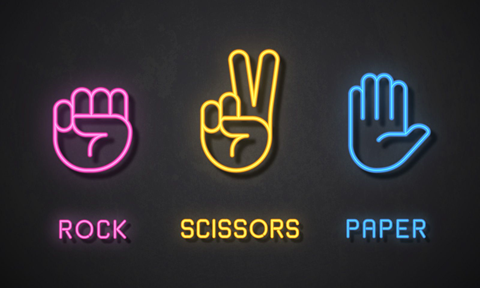

# SQL Database
### [Project: Chinook](https://github.com/maypn/myPortfolio/blob/a9173b5bdcc126a89c280b081f88f5e1845e884c/SQL%20Database/chinook.sql)

Explore and analyze data by using subqueries, window function and many more. 
    

    
### [Project: Restaurant database](https://github.com/maypn/myPortfolio/blob/a9173b5bdcc126a89c280b081f88f5e1845e884c/SQL%20Database/Restaurant_Database.sql) 

Using SQL to create a restaurant database.
    

  
# R Programming
### [Project: Rock Paper Scissors Game](https://github.com/maypn/myPortfolio/blob/a9173b5bdcc126a89c280b081f88f5e1845e884c/R%20Programming/Rock_Paper_Scissors_Game.R) 

A simple game that anyone can play and win. Let's Play a Game! 
    

    
# Python Programming
### [Project: Analyzing Sales Data](https://github.com/maypn/myPortfolio/blob/f5b7c36686e4c2e68cdff30b1675d6d61fc01b73/Python%20Programming/Analyzing_Sales_Data.ipynb)

Explore and analyze data to answer 10 interesting questions.

  
### [Project: OOP_ATM](https://github.com/maypn/myPortfolio/blob/f5b7c36686e4c2e68cdff30b1675d6d61fc01b73/Python%20Programming/OOP_ATM.py) 
  
5 ATM methods: Deposit, Withdraw, Check Balance, Bill Payment and Transfer. 
     

    
### [Project: Rock Paper Scissors Game](https://github.com/maypn/myPortfolio/blob/a9173b5bdcc126a89c280b081f88f5e1845e884c/Python%20Programming/Rock_Paper_Scissors_Game.py) 
    
A simple game that anyone can play and win. Let's Play a Game! 
    

    
  
# Data Visualization
### [Project: Sales Report](https://github.com/maypn/myPortfolio/blob/main/Dashboard/Sales_Report.pdf) 

Overview of sales report 2014-2017 by using Google Data Studio.  
  

    
### [Project: Summary Order Dashboard](https://github.com/maypn/myPortfolio/blob/6dafbf487ab7ed791eb9e0fcc86d1dbf9f7aeac4/Dashboard/Summary%20order%20dashboard.pdf) 

PowerBI dashboard on sales data using slicers, maps, bar chart and donut charts to analyze data. 
  

    
### [Project: Performance Dashboard](https://public.tableau.com/app/profile/mayp7482/viz/Tableau101_16594651781360/Dashboard1#1) 

Tableau dashboard on superstore data to get some insights out of the raw data.

